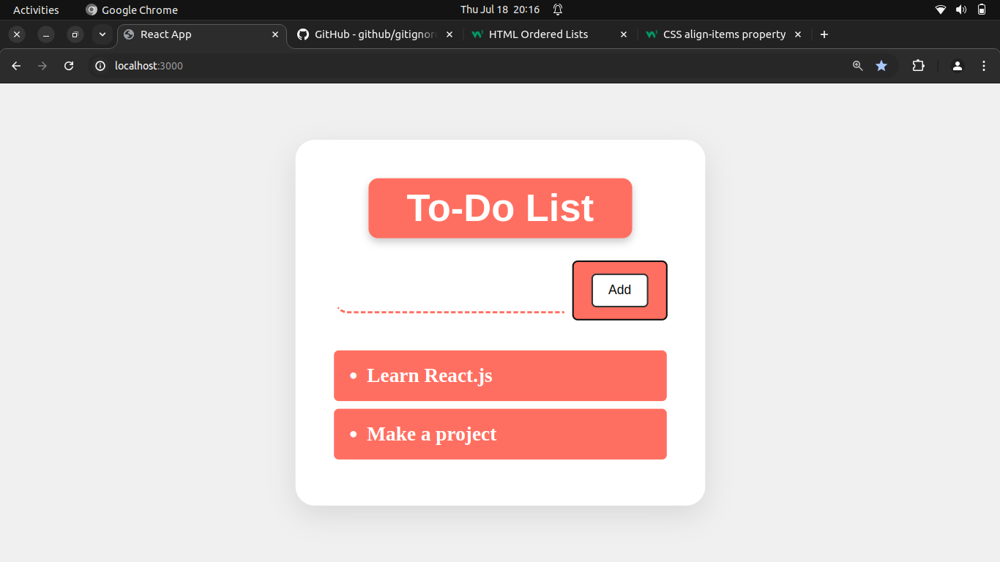

# To-Do List App

An open-source to-do list application built with React and Vite. This project helps users to keep track of their tasks, add new tasks, and display them in a dynamic list.

## Features

- Add new tasks to the to-do list.
- Display the list of tasks.
- Responsive design using React.

## Screenshots

 
_To-Do List page_

## Installation

1. Clone the repository:
    ```sh
    git clone https://github.com/kailashnirola/to-do-list-app.git
    ```
2. Navigate to the project directory:
    ```sh
    cd to-do-list-app
    ```

3. Install the dependencies:
    ```sh
    npm install
    ```

## Usage

1. Start the development server:
    ```sh
    npm run dev
    ```

2. Open your browser and go to `http://localhost:3000` to view the site.

## Technologies Used

- [React](https://reactjs.org/) - A JavaScript library for building user interfaces.
- [Vite](https://vitejs.dev/) - A build tool that provides a fast development environment.

## Contributing

Contributions are welcome! Please fork the repository and submit a pull request.

## License

This project is licensed under the ISC License. See the [LICENSE](LICENSE) file for details.

## Contact

For any questions or suggestions, please contact me at [b220017@nitsikkim.ac.in](mailto:b220017@nitsikkim.ac.in).

## Follow Me

- [LinkedIn](www.linkedin.com/in/kailash-nirola)
- [GitHub](https://github.com/kailashnirola/)
